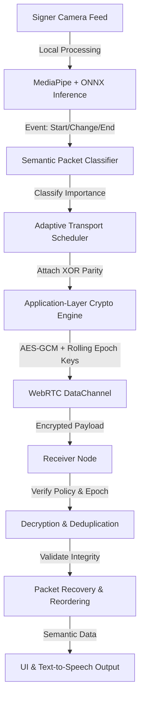

# Echo-Sign 2.0 / SecuSignFlow - Presentation Content

This document outlines the content for the 9 slides required for your presentation.

## Slide 1: Introduction
**Title:** Echo-Sign 2.0: Secure Semantic Transport for ISL Conferencing
*   **What it is:** A privacy-first, peer-to-peer WebRTC conferencing application tailored for real-time Indian Sign Language (ISL) communication.
*   **The Shift:** Moves away from traditional "video frame transport" to "event-driven semantic transport."
*   **Core Innovation:** Uses on-device inference to extract the *meaning* of gestures and transmits these semantic events securely with adaptive reliability, rolling session keys, and deterministic packet recovery.

## Slide 2: Literature Review
**Title:** State of Assistive Conferencing & Transport Security

| Title / Topic Area | Key Findings | Research Gaps |
| :--- | :--- | :--- |
| **Real-time Sign Language Translation** | Deep learning models (CNNs/RNNs) achieve high accuracy for isolated gesture recognition. | Focus is primarily on accuracy; ignores network efficiency and the high bandwidth required for continuous live video. |
| **Secure WebRTC for Assistive Tech** | WebRTC provides standard SRTP transport encryption which is effective against basic network eavesdropping. | Lacks application-layer semantic encryption, making it vulnerable to replay attacks or compromised endpoints. |
| **Semantic Communication Networks** | Transmitting "meaning" rather than raw data dramatically reduces bandwidth in theoretical IoT and 6G networks. | Rarely applied to real-time human communication streams like continuous sign language translation. |
| **Adaptive Transport Protocols** | Protocols like QUIC provide dynamic reliability based on network congestion states. | They are "payload-blind" and cannot prioritize reliability based on application-layer semantic packet importance. |

## Slide 3: Problem Statement
**Title:** The Challenge of Assistive Telepresence
*   Current sign language conferencing relies on continuous, high-bandwidth video streaming that degrades heavily under poor network conditions (e.g., rural areas, mobile networks).
*   Standard transport protocols do not distinguish between a critical meaning-changing gesture and a redundant transition frame.
*   Furthermore, standard transport layers lack the application-level security mechanisms required to protect sensitive semantic streams against replay attacks, policy downgrades, and stale-client synchronization issues.

## Slide 4: Objectives
**Title:** Project Goals

**Primary Objectives:**
1.  **Semantic-Aware Transport:** Develop an event-driven protocol (SecuSignFlow) that extracts ISL semantics locally and transmits lightweight semantic events instead of continuous video frames.
2.  **Adaptive Security & Reliability:** Implement an adaptive scheduler that protects high-importance semantic packets using rolling session keys (epochs) and verified XOR parity recovery.

**Secondary Objectives:**
1.  **Live Telemetry Visualization:** Design an industrial-grade, browser-based dashboard to visualize transport telemetry, packet recovery, and epoch rotation in real-time.
2.  **Measurable Efficiency:** Achieve measurable bandwidth savings and resilient packet delivery under simulated degraded network conditions compared to standard continuous transport.

## Slide 5: Methodology
**Title:** Architecture & Protocol Design
*   **Local On-Device Inference:** Browsers use MediaPipe and ONNX to track hands and classify ISL gestures locally. The server never sees raw video frames.
*   **Semantic Packet Classification:** Gestures are classified by importance into `CONTROL`, `CRITICAL`, `INTERACTIVE`, and `BEST_EFFORT`.
*   **Event-Driven Transmission:** Packets are only sent when a gesture starts, changes, or ends, avoiding redundant traffic.
*   **Security Layer:** Implements AES-256-GCM application-layer encryption over WebRTC DataChannels. Uses HKDF to derive rolling epoch keys that rotate during the session, with authenticated packet headers bound to the cipher.
*   **Deterministic Reliability:** An adaptive scheduler actively monitors RTT and loss to determine when to trigger custom retransmissions or XOR parity recovery for critical packets.

## Slide 6: Methodology (Diagram)
**Title:** SecuSignFlow Architecture Flow

## Slide 7: Tools and Techniques
**Title:** Tech Stack
*   **Frontend & UI:** HTML5, Vanilla CSS (Industrial Brutalist Design System), JavaScript.
*   **AI / Inference:** MediaPipe (Hand tracking pipeline), ONNX Runtime Web (In-browser ISL classification).
*   **Signaling & Backend:** Python 3.13, Flask, Socket.IO (Used *strictly* for signaling, auth, and policy sync).
*   **Security:** WebCrypto API, Python Cryptography (AES-GCM, RSA, HKDF for rolling keys).
*   **Transport Engine:** WebRTC (SRTP / Peer-to-Peer DataChannels).

## Slide 8: Outcomes
**Title:** Key Results & Capabilities
*   **Massive Bandwidth Savings:** Event-driven semantic transport drastically reduces network overhead by eliminating the need for continuous raw video streams.
*   **Network Resilience:** Critical gesture events are reliably delivered and reconstructed via XOR parity even under simulated 20% packet loss.
*   **Advanced Threat Mitigation:** Complete protection against replay attacks, policy downgrades, and stale-client desyncs using sliding replay windows and epoch rotation.
*   **Real-time Visibility:** The tactical telemetry HUD successfully provides real-time, live-action demonstration of encryption overhead, packet delivery rates, and reliability decisions.

## Slide 9: Conclusion
**Title:** Summary & Future Scope
*   **Conclusion:** Echo-Sign 2.0 successfully proves that shifting from "video frame transport" to "semantic transport" not only reduces network overhead for assistive communication but enables highly customized, priority-aware security measures.
*   **Future Scope:** 
    *   Implementing multi-party mesh semantic routing.
    *   Enhancing the local ONNX model to recognize full continuous sign language phrases rather than static gestures.
    *   Expanding the transport layer to support dynamic bandwidth aggregation across multiple network interfaces.
