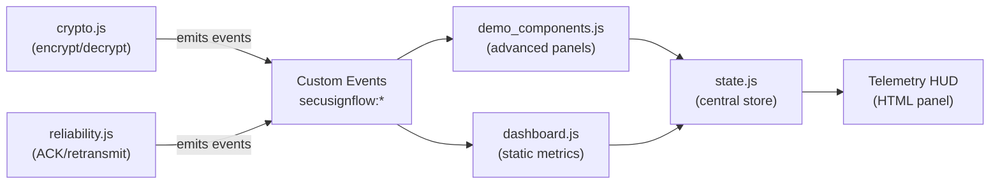

# SecuSignFlow Telemetry — Complete Reference & Demo Guide

> **Project**: Echo-Sign 2.0 / SecuSignFlow  
> **Subject**: Network Programming & Security Lab  
> **Scope**: Every metric, every button, and a step-by-step faculty presentation flow

---

## Table of Contents

1. [Telemetry Architecture Overview](#1-telemetry-architecture-overview)
2. [Metric Dictionary — Security Layer](#2-metric-dictionary--security-layer)
3. [Metric Dictionary — Physical Layer](#3-metric-dictionary--physical-layer)
4. [Metric Dictionary — Packet Classes](#4-metric-dictionary--packet-classes)
5. [Network Degradation Sandbox](#5-network-degradation-sandbox)
6. [Latest Packet Header](#6-latest-packet-header)
   - 6.1 [Detailed Header Field Glossary](#61-detailed-header-field-glossary)
7. [Advanced Demo Panels](#7-advanced-demo-panels)
8. [Interactive Button Reference](#8-interactive-button-reference)
9. [Export Metrics](#9-export-metrics)
10. [Faculty Demo Guide — 12-Minute Presentation Flow](#10-faculty-demo-guide--12-minute-presentation-flow)

---

## 1. Telemetry Architecture Overview

The telemetry HUD is a **collapsible side-panel** opened via the `TELEMETRY` button in the conference header. It is divided into **static metric groups** (rendered by `dashboard.js`) and **advanced demo panels** (rendered by `demo_components.js`). All state lives in a single reactive object defined in `state.js`.



**Data flow**: Every packet encrypted, sent, received, or rejected fires a `CustomEvent` on the `window` object. The demo panels listen for four event types:

| Event Name | Fired When | Source File |
|---|---|---|
| `secusignflow:packet` | A packet is created, classified, scheduled, encrypted, sent, verified, accepted, or rejected | `crypto.js`, `reliability.js`, `main.js` |
| `secusignflow:decision` | The scheduler makes a transport reasoning decision | `crypto.js`, `reliability.js` |
| `secusignflow:integrity` | A packet header's commitment hash is verified | `crypto.js` |
| `secusignflow:recovery` | A lost packet is reconstructed via parity | `reliability.js` |

---

## 2. Metric Dictionary — Security Layer

Located under the **`// SECURITY_LAYER`** heading in the telemetry panel.

| Label on UI | Element ID | Meaning | Source / How It's Computed | Use Case |
|---|---|---|---|---|
| **TLS_SIG** | *(static text)* | TLS status for the Socket.IO signaling channel | Always `ACTIVE` — Flask serves over HTTPS with `cert.pem` / `key.pem` | Proves the signaling plane (room creation, WebRTC offer/answer, ICE) is encrypted in transit |
| **WEBRTC** | `monitorWebrtc` | Whether a peer-to-peer WebRTC connection exists | `state.peerConnections.size > 0` → "Connected", else "Waiting" | Shows the media/data plane link status between two participants |
| **AES_GCM** | *(static text)* | Application-layer encryption algorithm | Always `ACTIVE` — every semantic packet is AES-256-GCM encrypted in `crypto.js` | Proves data confidentiality even over the already-encrypted DTLS/SRTP channel |
| **POLICY** | `monitorPolicy` | Whether the transport policy fingerprint has been verified | `state.policyFingerprint ? "Verified" : "Pending"` | Confirms both peers agree on the same scheduling rules (which packets get parity, retransmission, etc.) |
| **HASH** | `monitorPolicyFingerprint` | First 12 hex chars of the SHA-256 policy fingerprint | `state.policyFingerprint.slice(0, 12)` | Provides a visual indicator that the policy object hasn't been tampered with |
| **EPOCH** | `monitorEpoch` | Current epoch ID (key rotation generation) | `state.currentEpoch`, incremented every `packetsPerEpoch` (default 32) packets | Shows how many times the AES-GCM key has been rotated; higher = more forward secrecy |
| **REPLAY** | `monitorReplay` | *(static text)* | Always `ENABLED` | Indicates the replay-window guard is active (64-counter sliding window + epoch staleness check) |
| **EPOCH_PROG** | `monitorEpochProgress` | Packets used in the current epoch vs. total before next key rotation | `packetCounter % packetsPerEpoch` / `packetsPerEpoch` | Lets you visually see when the next key rotation will trigger |

---

## 3. Metric Dictionary — Physical Layer

Located under the **`// PHYSICAL_LAYER`** heading.

| Label on UI | Element ID | Meaning | Source / How It's Computed | Use Case |
|---|---|---|---|---|
| **TX_PKT** | `statsSent` | Total packets transmitted (outbound) | `reliabilityState.stats.packetsSent` — incremented in `sendReliableMessage()` | Measures outbound traffic volume |
| **RX_PKT** | `statsReceived` | Total packets received (inbound) that passed deduplication | `reliabilityState.stats.packetsReceived` — incremented in `processInboundReliability()` | Measures inbound traffic volume |
| **ACK_RX** | `statsAcked` | Total ACK packets received for outbound messages | `reliabilityState.stats.packetsAcked` — incremented when an ACK matches an unacked sequence number | Confirms delivery reliability; `ACK_RX ≈ TX_PKT` means near-perfect delivery |
| **RETX** | `statsRetries` | Total retransmissions triggered by ACK timeout | `reliabilityState.stats.retransmissions` — incremented in `handleRetransmission()` after 250 ms ACK timeout | Measures network instability; high RETX = high packet loss or latency |
| **DUP_DROP** | `statsDupes` | Duplicate packets suppressed by the replay window | `reliabilityState.stats.duplicatesDropped` — incremented when `inboundSeqCache` detects a repeated `seqNum` | Proves the deduplication guard is working |
| **RECOVER** | `statsRecovered` | Packets recovered via parity + retransmission combined | `state.transportStats.recovered + reliabilityState.stats.retransmissions` | Shows the system's self-healing capability |
| **RPL_REJ** | `statsReplayRejected` | Replay attack attempts rejected (duplicates + stale epoch) | `state.transportStats.replayRejected` — incremented on duplicate detection or stale epoch rejection | Proves the system defends against replay/injection attacks |
| **DATA_TX** | `statsBytes` | Estimated bytes transferred (sent + received) | `(packetsSent + packetsReceived) × 180 bytes` per JSON event | Approximates bandwidth consumption; demonstrates semantic transport is lightweight vs video streaming |

---

## 4. Metric Dictionary — Packet Classes

Located under the **`// PACKET_CLASSES`** heading. These are the four semantic labels defined in `semantic.py`.

| Label | Element ID | What Generates It | Transport Policy | Use Case |
|---|---|---|---|---|
| **CONTROL** | `classControl` | Room creation, WebRTC offer/answer/ICE, epoch sync, policy refresh | Highest reliability, aggressive redundancy, priority 0 (top) | Session signaling — losing these breaks the connection |
| **CRITICAL** | `classCritical` | Gesture recognition events (`gesture_change`), ISL frames, encrypted semantic packets | High reliability, parity-based redundancy, aggressive recovery | The core sign-language data — must always arrive |
| **INTERACT** | `classInteractive` | Voice/text chat messages | Medium reliability, selective redundancy, selective recovery | Conversational messages — important but not mission-critical |
| **BEST_EFF** | `classBestEffort` | Auxiliary/fallback packets that don't match any rule | Low reliability, no redundancy, no recovery | Background telemetry — acceptable to lose under congestion |

> [!IMPORTANT]
> The scheduler **deprioritizes BEST_EFFORT** packets when loss exceeds 10%, protecting CRITICAL and CONTROL traffic. This adaptive behavior is the key differentiator from a baseline system.

---

## 5. Network Degradation Sandbox

Located under the **`// NETWORK_DEGRADATION`** heading. These are **input controls**, not read-only metrics.

| Control | Element ID | Range | Effect |
|---|---|---|---|
| **Loss Preset Buttons** | `data-loss-preset="0/5/10/20"` | 0–20% quick-set | Sets `networkSimulator.packetLossPct` instantly |
| **PKT_LOSS slider** | `simPacketLoss` | 0–80% | Deterministic packet drop — uses a seeded PRNG so results are reproducible |
| **DELAY_BASE slider** | `simDelay` | 0–1000 ms | Adds fixed latency before every `DataChannel.send()` |
| **JITTER slider** | `simJitter` | 0–500 ms | Adds random ± variation on top of base delay |

> [!TIP]
> **For the demo**: Set loss to 20% and watch RETX and RECOVER climb while the Reliability State panel switches to "Protected Critical Transport" mode.

---

## 6. Latest Packet Header

Located under the **`// LATEST_HEADER`** heading. Displays the raw JSON of the most recent packet header.

| Field | Type | Meaning |
|---|---|---|
| `packet_id` | int | Monotonically increasing packet identifier |
| `semantic_label` | string | Classification: CONTROL / CRITICAL / INTERACTIVE / BEST_EFFORT |
| `epoch_id` | int | Which key-rotation epoch this packet belongs to |
| `packet_counter` | int | Global packet counter (used for epoch rotation trigger) |
| `timestamp` | int | Unix timestamp (seconds) embedded in the AEAD additional data |
| `commitment_hash` | string | SHA-256 chain hash: `H(prev_hash : counter : label : epoch)` — links packets into a verifiable sequence |
| `policy_fingerprint` | string | SHA-256 fingerprint of the transport policy table — validated on receive |
| `parity_group` | int \| null | Parity recovery group ID (null if parity not enabled for this class) |

### 6.1 Detailed Header Field Glossary

#### `packet_id` — Packet Identifier
- **What**: Monotonically increasing integer assigned to every outgoing packet.
- **Computed**: `stateObj.packetCounter += 1` before every `encryptPacket()` call (`crypto.js:67`).
- **Purpose**: Uniquely identifies every packet. Used by the **replay window** (2000-entry cache) to detect duplicates, and by the **epoch rotation** trigger (`packet_id % packetsPerEpoch == 0`).

#### `semantic_label` — Packet Priority Class
- **What**: One of `CONTROL`, `CRITICAL`, `INTERACTIVE`, or `BEST_EFFORT`.
- **Computed**: Assigned by the classifier in `semantic.py`. Client-side defaults to `"CRITICAL"` for gesture packets.
- **Purpose**: Determines the entire transport policy — redundancy, parity, retransmission aggressiveness, and scheduling priority. Under congestion (loss >10%), `BEST_EFFORT` is deprioritized to protect `CRITICAL`/`CONTROL`.

#### `epoch_id` — Key Rotation Generation
- **What**: Integer identifying which AES-256-GCM key was used to encrypt this packet. Starts at `0`, increments every 32 packets.
- **Computed**: `stateObj.currentEpoch += 1` when `(packetCounter - 1) % packetsPerEpoch === 0` (`crypto.js:70–75`).
- **Purpose**:
  - **Forward secrecy**: Each epoch derives a new key via PBKDF2 with salt `"{roomId}_epoch_{epoch}"`. Compromising key N doesn't expose epochs N−1 or N+1.
  - **Staleness rejection**: Packets with `epoch_id < currentEpoch − epochGrace` (grace = 1) are rejected as stale.

#### `packet_counter` — Global Sequence Counter
- **What**: Session-wide counter matching `packet_id`, embedded so the receiver can verify packet position.
- **Computed**: Same as `packet_id` — `stateObj.packetCounter`.
- **Purpose**: (1) Triggers epoch rotation when `counter % packetsPerEpoch == 0`. (2) Is part of the **commitment hash preimage**, binding each packet to its exact stream position.

#### `timestamp` — Encryption Timestamp
- **What**: Unix epoch timestamp (seconds) when the packet was encrypted.
- **Computed**: `Math.floor(Date.now() / 1000)` stored as 8-byte BigUint64 (`crypto.js:82–84`).
- **Purpose**: Concatenated with header bytes to form the **AEAD additional data** (authenticated but not encrypted). If an attacker replays the packet at a different time, the `additionalData` mismatch causes AES-GCM to fail — a time-binding anti-replay defense on top of the sequence-based window.

#### `commitment_hash` ⭐ — Integrity Chain Hash
- **What**: A **SHA-256 chain hash** linking every packet to all previous packets in a tamper-evident sequence (like a blockchain hash chain).
- **Computed** (`crypto.js:86–89`):
  ```
  commitment_hash(N) = SHA-256( commitment_hash(N-1) : packet_counter : semantic_label : epoch_id )
  ```
  Where `:` is a literal colon. Genesis root is `""` (empty string). Result is full 64-char hex digest.
- **Purpose**:
  1. **Tamper detection**: Modifying/inserting/deleting any packet breaks the chain — all subsequent hashes become invalid.
  2. **Ordering guarantee**: Chaining prevents packet reordering without detection.
  3. **Verification**: Receiver calls `key_manager.verify_commitment(header)` (`rooms.py:144`), recomputing the expected hash. Mismatch increments `failure_count`; after 3 failures → **session resync** (re-derive key, reset chain, resume).
  4. **Demo**: The "Invalidate Commitment" button breaks the chain so you can demonstrate detection + resync to faculty.

#### `policy_fingerprint` — Transport Policy Integrity Hash
- **What**: First 16 hex chars of SHA-256 hash of the **canonical transport policy table**.
- **Computed** (`policy_verification.py:15–20`):
  ```python
  canonical = json.dumps(policy, sort_keys=True, separators=(",", ":")).encode("utf-8")
  fingerprint = hashlib.sha256(canonical).hexdigest()[:16]
  ```
- **Purpose**:
  1. **Policy integrity**: Every packet carries this. Receiver checks `header.policy_fingerprint !== local fingerprint` — mismatch = rejection. Prevents an attacker from downgrading transport rules.
  2. **Peer agreement**: Both peers receive the same fingerprint during WebRTC signaling. `POLICY: Verified` confirms agreement.
  3. **RSA-signed audit**: Server also RSA-signs the policy for non-repudiation.

#### `parity_group` — Recovery Group ID
- **What**: Integer identifying the **XOR parity recovery group**, or `null` if parity is disabled for this packet class.
- **Computed** (`rooms.py:109–114`): `VerifiedParityRecovery` groups packets into blocks of 3 with monotonic `group_id`. When complete, an XOR parity packet is stored.
- **Purpose**:
  1. **Loss recovery without retransmission**: If 1 of 3 packets is lost, reconstruct from the other 2 + XOR parity — no round-trip needed.
  2. **Semantic-aware**: Only `CRITICAL`/`CONTROL` get parity. `BEST_EFFORT` does not, saving bandwidth.
  3. **Verified recovery**: Recovered packets have their commitment hash verified against the integrity chain.

> [!NOTE]
> In the HUD's Latest Header panel, only the first 8 chars of `commitment_hash` are displayed for readability. The full 64-char hex string is in the exported JSON dump.

---

## 7. Advanced Demo Panels

These are injected into `#advancedDemoPanels` by `demo_components.js`. Each panel visualizes a specific transport subsystem.

### 7.1 Demo Mode Toggle
- **Baseline Mode**: Static AES session key, no rolling keys, no adaptive scheduling, no verified recovery.
- **SecuSignFlow Mode**: Rolling epoch keys, semantic scheduling, replay rejection, verified parity recovery.

### 7.2 Packet Flow Visualizer
Shows the **lifecycle** of the latest packet through 9 stages:
`Created → Classified → Scheduled → Encrypted → Sent → Verified → Recovered → Accepted → Rejected`

### 7.3 Epoch Monitor
- Progress bar showing packets consumed in the current epoch
- "Packets before rotation" countdown
- Replay window status (64 counters or Disabled in baseline)
- Previous epoch grace period (1 epoch tolerance)

### 7.4 Replay Attack Panel
- Shows integrity guard status: "Ready" or "Guarded"
- Displays total replay rejection count

### 7.5 Recovery Visualizer
Shows the recovery pipeline: `Packet Lost → Parity Used → Packet Reconstructed → Integrity Verified` with group ID, missing packet ID, and validation status.

### 7.6 Reliability State Panel
- Current loss percentage and mode (Normal vs Protected Critical Transport)
- Redundancy level, retransmission status, scheduler type, parity status, BEST_EFFORT priority

### 7.7 Packet Timeline
Horizontal scrolling strip of color-coded packet chips showing ID, type, and timestamp.

### 7.8 Security Dashboard
Five binary health indicators:
- Policy Verified (is the fingerprint set?)
- Epoch Synced (no integrity failure?)
- Replay Window Healthy (not in baseline mode?)
- Integrity Chain Valid (all chain entries valid?)
- Recovery Active (in SecuSignFlow mode?)

### 7.9 Packet Heatmap
Proportional bar chart of packet counts by class (CONTROL, CRITICAL, INTERACTIVE, BEST_EFFORT).

### 7.10 Decision Log
Timestamped list of scheduler reasoning entries (e.g., "Packet classified as CRITICAL → parity enabled → retransmission enabled").

### 7.11 Integrity Chain
Visual chain of packets: `P1 → P2 → P3 → ...` with epoch labels and broken-chain highlighting.

### 7.12 Session Resync Flow
5-stage pipeline: `Integrity Failure → Threshold Exceeded → Session Resync Triggered → Epoch Resynchronized → Session Restored`

---

## 8. Interactive Button Reference

### 8.1 Replay Attack Buttons

| Button | Icon | Element ID | Backend Action | What It Demonstrates |
|---|---|---|---|---|
| **Replay Last Packet** | 🔁 `fa-repeat` | `btnReplayLastPacket` | Emits `replay_last_packet` — server calls `room.reliability.record_reject(replay=True)` | Shows the system detecting and rejecting a replayed packet counter |
| **Inject Duplicate** | 📋 `fa-clone` | `btnDuplicatePacket` | Emits `inject_duplicate_packet` — suppresses duplicate before application delivery | Shows deduplication via the inbound sequence cache |
| **Simulate Stale Packet** | ⏰ `fa-clock-rotate-left` | `btnStalePacket` | Emits `simulate_stale_packet` — creates packet with epoch outside grace window | Shows epoch-based staleness rejection |

### 8.2 Session Resync Buttons

| Button | Icon | Element ID | Backend Action | What It Demonstrates |
|---|---|---|---|---|
| **Force Epoch Mismatch** | ⇄ `fa-code-compare` | `btnEpochMismatch` | `force_epoch_mismatch` — increments `failure_count`, sets receiver to REJECT | Shows what happens when a peer sends a packet from a future/invalid epoch |
| **Invalidate Commitment** | 🔗‍💥 `fa-link-slash` | `btnBadCommitment` | `invalidate_commitment_chain` — breaks the integrity hash chain | Shows how a tampered commitment hash is detected and rejected |
| **Trigger Resync** | 🔄 `fa-rotate` | `btnTriggerResync` | `trigger_resync` — resets commitment root, resets failure count, restores session | Shows the recovery procedure: re-derive epoch key, reset chain, resume |

### 8.3 Other Buttons

| Button | Element ID | Action |
|---|---|---|
| **TELEMETRY** | `btnOpenTelemetry` | Opens the telemetry side panel |
| **✕ (Close)** | `btnToggleDashboard` | Collapses the telemetry panel |
| **EXPORT_DUMP** | `btnExportMetrics` | Downloads a full JSON snapshot of all metrics, timelines, decision logs, and integrity chain |

---

## 9. Export Metrics

The **EXPORT_DUMP** button downloads a JSON file named `secusignflow-metrics-<timestamp>.json` containing:

```json
{
  "exported_at": "ISO timestamp",
  "packet_classes": { "CONTROL": N, "CRITICAL": N, "INTERACTIVE": N, "BEST_EFFORT": N },
  "reliability": { "packetsSent": N, "packetsAcked": N, "retransmissions": N, "duplicatesDropped": N, "packetsReceived": N },
  "epoch": N,
  "packet_counter": N,
  "transport_mode": "secusignflow | baseline",
  "policy_fingerprint": "hex string",
  "latest_packet_header": { "...full header..." },
  "packet_flow": [ "...last 8 packet events..." ],
  "packet_timeline": [ "...last 28 timeline chips..." ],
  "decision_log": [ "...last 12 scheduler decisions..." ],
  "recovery_events": [ "...last 5 recovery records..." ],
  "integrity_chain": [ "...last 10 chain entries..." ],
  "simulator": { "packetLossPct": N, "baseDelayMs": N, "jitterMs": N }
}
```

> [!TIP]
> Export the JSON at the end of your demo to show faculty a "lab report" of everything that happened during the session.

---

## 10. Faculty Demo Guide — 12-Minute Presentation Flow

### Phase 0 — Setup (before the demo, ~1 min)

1. Start the Flask server (`python app_conference_secure.py`).
2. Open **two browser tabs** (or two different browsers) pointed at the HTTPS URL.
3. In Tab 1: Create a room as **SIGNER**, copy the Room ID.
4. In Tab 2: Join the room as **VIEWER**, paste Room ID.
5. Verify both peers see each other's video and the WebRTC badge says "Connected".

---

### Phase 1 — "What Is the Telemetry?" (~2 min)

1. Click the **TELEMETRY** button in Tab 1.
2. Walk through the **Security Layer** group top-to-bottom:
   - *"TLS_SIG is active — our signaling channel (Socket.IO) runs over HTTPS."*
   - *"WebRTC shows Connected — the media plane is up with DTLS-SRTP."*
   - *"AES_GCM is our application-layer encryption — even if someone intercepted the DataChannel, the payload is AES-256-GCM encrypted."*
   - *"POLICY is Verified — both peers have agreed on the same transport scheduling rules."*
   - *"EPOCH shows the current key rotation generation."*
3. Point to **EPOCH_PROG** → *"After every 32 packets, we derive a new AES key. This is forward secrecy."*

---

### Phase 2 — "How Packets Are Classified" (~2 min)

1. In Tab 1, **make a sign gesture** in front of the camera → Watch `CRITICAL` count increment.
2. In Tab 2, **type a chat message** → Watch `INTERACTIVE` count increment.
3. Point to the **Packet Heatmap** panel → *"CRITICAL dominates because sign language gestures are the core payload."*
4. Point to the **Decision Log** → *"Each entry shows the scheduler's reasoning: 'Packet classified as CRITICAL → parity enabled → retransmission enabled'."*
5. Show the **Latest Header** JSON → Explain `semantic_label`, `epoch_id`, `commitment_hash`.

---

### Phase 3 — "Simulating Network Degradation" (~2 min)

1. Set **PKT_LOSS to 20%** using the preset button.
2. Watch in real-time:
   - **RETX** starts climbing (retransmissions triggered by ACK timeouts).
   - **RECOVER** increments (parity recovery kicks in).
   - The **Reliability State** panel switches to **"Protected Critical Transport"** mode.
3. Point to the **Baseline vs SecuSignFlow comparison** table:
   - *"In baseline, packet loss recovery is 'None'. In SecuSignFlow, it's 'Verified parity + ACK'."*
   - *"In baseline, critical packet delivery is 'Degraded'. In SecuSignFlow, it's 'Protected'."*
4. Set loss back to 0%.

---

### Phase 4 — "Replay Attack Defense" (~2 min)

1. Click the **Replay Last Packet** (🔁) button.
2. Observe:
   - A **toast** appears: "Replay packet rejected by transport guard."
   - **RPL_REJ** increments in Physical Layer.
   - The **Packet Flow** visualizer shows the packet reaching "Rejected" stage.
   - The **Decision Log** records: "Replay rejection: Duplicate packet counter rejected by replay window."
3. Click **Inject Duplicate** (📋) → Same rejection, different reason.
4. Click **Simulate Stale Packet** (⏰) → Rejected because the epoch is outside the grace window.
5. *"This proves our system defends against three types of replay attacks."*

---

### Phase 5 — "Integrity Chain & Session Resync" (~2 min)

1. Point to the **Integrity Chain** panel → *"Each packet links to the previous via a SHA-256 commitment hash. If any packet is tampered, the chain breaks."*
2. Click **Force Epoch Mismatch** (⇄) → The Security Dashboard shows "Epoch Synced: Watch".
3. Click **Invalidate Commitment** (🔗‍💥) → A chain entry appears with a red "broken" indicator.
4. Click **Trigger Resync** (🔄):
   - The **Session Resync** flow lights up all 5 stages to "Session Restored".
   - The Security Dashboard returns to all-green.
   - Decision Log: "Session resync triggered → epoch resynchronized → session restored."
5. *"This is self-healing: the system detects integrity failures, counts them against a threshold, and automatically re-derives keys."*

---

### Phase 6 — "Export & Wrap-Up" (~1 min)

1. Click **EXPORT_DUMP** → Download the JSON file.
2. Open it briefly → *"This is a full audit trail: every packet event, every scheduler decision, every recovery, the entire integrity chain."*
3. Toggle to **Baseline Mode** → Show how the comparison table degrades (no recovery, no replay rejection, static keys).
4. Toggle back to **SecuSignFlow Mode** → *"This is the value our system adds over a naive baseline."*

---

### Key Talking Points Summary

| Question Faculty May Ask | Your Answer |
|---|---|
| *"What encryption do you use?"* | AES-256-GCM with PBKDF2-derived keys (100k iterations, SHA-256). Keys rotate every 32 packets via epoch-based re-derivation. |
| *"How do you handle packet loss?"* | Dual mechanism: (1) ACK-based retransmission with 250ms timeout, max 5 retries; (2) XOR parity recovery in groups of 3 packets. |
| *"How do you prevent replay attacks?"* | Three layers: (1) Sequence number deduplication cache (2000 entries); (2) Epoch staleness check with 1-epoch grace; (3) SHA-256 commitment hash chain. |
| *"What makes this different from just using WebRTC?"* | WebRTC provides DTLS-SRTP for media, but our semantic DataChannel adds application-layer AES-GCM, packet classification (4 priority classes), adaptive scheduling, and verified recovery — none of which exist in vanilla WebRTC. |
| *"Is this real or simulated?"* | The encryption, key rotation, and packet framing are fully real (Web Crypto API). The network degradation sandbox uses a deterministic simulator for reproducible demo results. The sign language recognition runs a real ONNX model with MediaPipe hand tracking. |
